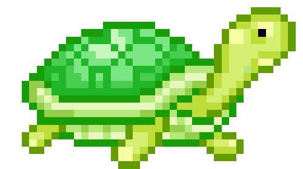
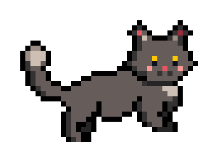
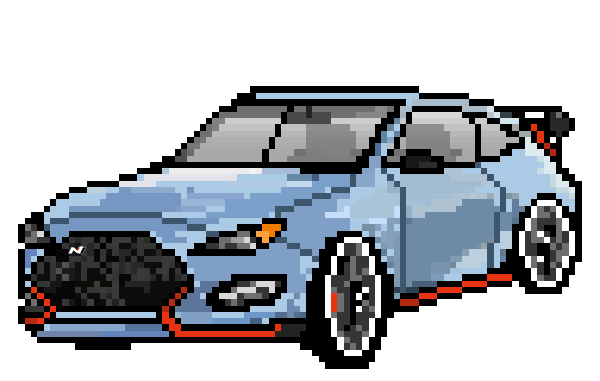
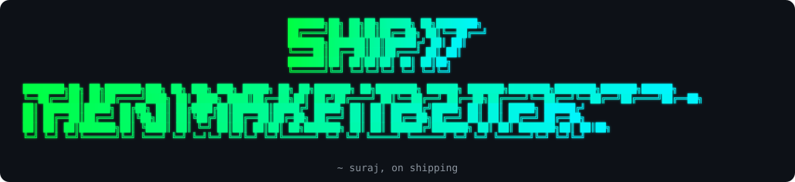

<!-- ============================ TERMINAL HEADER ============================ -->
<p align="center">
  
</p>

<p align="center">
  <a href="https://www.linkedin.com/in/surajsingh-rajpurohit-546335286/"></a>
  <a href="mailto:rajpurohitsuraj689@gmail.com"></a>
  <a href="https://topmate.io/surajsingh_rajpurohit"></a>
  <a href="https://medium.com/@rajpurohitsuraj689"></a>
  <a href="https://blushing-salesman-e9a.notion.site/My-Portfolio-2d1065fc5db580c984e6f5c080dc54de"></a>
</p>

<p align="center">
  
  
</p>

<!-- ============================ WHOAMI ============================ -->
## `$ whoami` 


<p><em>
  <b>AI Software Engineer</b> building production voice AI &amp; LLM apps <br/>
  Member of Technical Staff @ <b>Vokido</b>, an AI English voice tutor for kids <br/>
  B.Tech in IT, Dwarkadas J. Sanghvi College of Engineering, Mumbai 
</em></p>

```ts
const suraj = {
  code:       ["TypeScript", "Python", "SQL", "JavaScript", "C++"],
  ai:         ["GPT-4o", "Gemini", "Whisper", "Deepgram", "Sarvam", "Cartesia"],
  backend:    ["PostgreSQL", "Supabase", "Deno", "Hono"],
  automation: ["n8n", "multi-agent pipelines", "voice agents"],
  askMeAbout: "voice AI pipelines, LLM apps, AI agents, Postgres",
};
```

<!-- ============================ QUICK FACTS ============================ -->
## `$ cat quick_facts.md` 


- 🎙️ Built **Say It Again**, a speech-practice loop on **STT → LLM → TTS**, and cut **3–4s** of voice lag
- 📺 Shipped **Voki's World** from prototype to production: a kids' story-video library with **470+ views**
- 🧪 Took a backend test suite to **971/971 passing** (100% coverage on my feature)
- 🤖 Built **5+ AI agents** and **2 voice agents** that automated an agency's workflows
- 🏆 **Top 10** of 1,000+ registrations at the **Media.net aiVOLUTION Hackathon**
- ✍️ **LinkedIn Top Voice ×2** (1.4M+ impressions) · **Top 1% Topmate mentor** · featured on the **Times Square billboard**
- 🔥 Fun fact: that's me in prod. Calm, typing, everything under control.

<br clear="right" />

<!-- ============================ TECH STACK ============================ -->
<details open>
  <summary><h2>🛠️ Tech Stack</h2></summary>

  <h3>👨‍💻 Languages</h3>
  <p>
    
    
    
    
    
    
    
    
    
  </p>

  <h3>🤖 AI, Voice &amp; ML</h3>
  <p>
    
    
    
    
    
    
    
    
    
    
    
    
    
  </p>

  <h3>🧰 Frameworks &amp; Runtimes</h3>
  <p>
    
    
    
    
    
    
  </p>

  <h3>🗄️ Databases</h3>
  <p>
    
    
    
    
  </p>

  <h3>🚀 DevOps &amp; Product Tools</h3>
  <p>
    
    
    
    
    
    
    
    
  </p>

  <h3>💻 Daily Drivers</h3>
  <p>
    
    
    
    
    
    
  </p>
</details>

<!-- ============================ STATS ============================ -->
<details>
  <summary><h2>📊 Stats and Activity</h2></summary>

  <h3>📈 Activity, including private work</h3>
  <p>
    <!-- Generated daily by .github/workflows/metrics.yml (lowlighter/metrics) -->
    
  </p>

  <h3>🔥 Streak</h3>
  <p>
    
  </p>

  <h3>🏆 Trophies</h3>
  <p>
    
  </p>
</details>

<!-- ============================ MEDIUM ============================ -->
## `$ tail -f medium.feed` 

<!-- BLOG-POST-LIST:START -->
<!-- BLOG-POST-LIST:END -->

<!-- ============================ QUOTE + FOOTER ============================ -->
<br/>
<p align="center">
  
</p>

<p align="center">
  
</p>

<!-- GIF credits: pixel art from github.com/ddroid, hacker cat via Giphy (github.com/Thaiane), Moss / The IT Crowd via Giphy. -->
